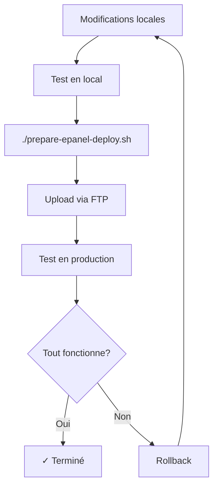

# 🏰 Déploiement Château Lastours sur ePanel

## 📚 Documentation Disponible

Voici tous les documents créés pour t'aider dans ton déploiement :

### 🚀 Pour Démarrer

| Document | Description | Quand l'utiliser |
|----------|-------------|------------------|
| **QUICK_START_EPANEL.md** | Guide ultra-rapide en 5 étapes | Tu veux déployer rapidement |
| **EPANEL_DEPLOYMENT_GUIDE.md** | Guide complet et détaillé | Tu veux comprendre chaque étape |
| **EPANEL_CHECKLIST.md** | Checklist complète | Tu veux suivre ta progression |

### 🛠️ Outils

| Fichier | Description | Usage |
|---------|-------------|-------|
| **prepare-epanel-deploy.sh** | Script automatique de préparation | `./prepare-epanel-deploy.sh` |
| **.htaccess** | Configuration Apache | Copié automatiquement par le script |

---

## ⚡ Démarrage Rapide (TL;DR)

```bash
# 1. Prépare ton site
cd "/Users/danyvassily/dev /chateaulastour-mvp/chateaulastour"
./prepare-epanel-deploy.sh

# 2. Upload via FTP
# - Ouvre FileZilla
# - Connecte-toi à ton serveur
# - Upload le contenu de out/ vers public_html/

# 3. Teste
# Ouvre https://tondomaine.com
```

---

## 🎯 Choisis Ton Parcours

### 👤 Je suis débutant

1. Commence par **QUICK_START_EPANEL.md**
2. Utilise **EPANEL_CHECKLIST.md** pour suivre ta progression
3. En cas de problème, consulte **EPANEL_DEPLOYMENT_GUIDE.md** (section Dépannage)

### 🔧 Je suis expérimenté

1. Lance `./prepare-epanel-deploy.sh`
2. Upload via FTP
3. Configure SSL/HTTPS
4. Teste et optimise

### 📖 Je veux tout comprendre

1. Lis **EPANEL_DEPLOYMENT_GUIDE.md** en entier
2. Utilise **EPANEL_CHECKLIST.md** pour la mise en pratique
3. Lance le script et déploie

---

## 📋 Prérequis

### Sur Ton Ordinateur

- ✅ Node.js >= 18.0.0
- ✅ pnpm >= 8.0.0
- ✅ FileZilla ou client FTP similaire

### Chez Ton Hébergeur

- ✅ Accès ePanel/cPanel
- ✅ Compte FTP actif
- ✅ Apache avec mod_rewrite activé (généralement déjà le cas)
- ✅ Certificat SSL (Let's Encrypt gratuit recommandé)

---

## 🏗️ Architecture du Déploiement

```
┌─────────────────────────────────────────────┐
│  1. TON ORDINATEUR                          │
│  ┌───────────────────────────────────────┐  │
│  │ Projet Next.js                        │  │
│  │ /chateaulastour                       │  │
│  └───────────────┬───────────────────────┘  │
│                  │                           │
│                  │ pnpm run build            │
│                  ▼                           │
│  ┌───────────────────────────────────────┐  │
│  │ Build Statique                        │  │
│  │ /out/                                 │  │
│  │  ├── index.html                       │  │
│  │  ├── .htaccess                        │  │
│  │  ├── _next/ (assets)                  │  │
│  │  └── [pages...]                       │  │
│  └───────────────┬───────────────────────┘  │
└──────────────────┼───────────────────────────┘
                   │
                   │ FTP Upload (FileZilla)
                   │
┌──────────────────▼───────────────────────────┐
│  2. SERVEUR ePanel                          │
│  ┌───────────────────────────────────────┐  │
│  │ public_html/                          │  │
│  │  ├── index.html                       │  │
│  │  ├── .htaccess                        │  │
│  │  ├── _next/                           │  │
│  │  └── [pages...]                       │  │
│  └───────────────┬───────────────────────┘  │
│                  │                           │
│                  │ Apache + mod_rewrite      │
│                  ▼                           │
│  ┌───────────────────────────────────────┐  │
│  │ Site Web en Ligne                     │  │
│  │ https://tondomaine.com                │  │
│  └───────────────────────────────────────┘  │
└─────────────────────────────────────────────┘
```

---

## 🔐 Sécurité et Bonnes Pratiques

### ✅ Inclus Automatiquement

- ✅ Redirection automatique HTTP → HTTPS
- ✅ En-têtes de sécurité (X-Frame-Options, X-XSS-Protection, etc.)
- ✅ Protection des fichiers sensibles
- ✅ Désactivation de l'indexation des répertoires
- ✅ Compression Gzip pour les performances
- ✅ Mise en cache optimisée

### 🔒 À Faire Manuellement

- [ ] Activer le certificat SSL dans ePanel
- [ ] Configurer les sauvegardes automatiques
- [ ] Mettre en place un monitoring (optionnel)
- [ ] Configurer un CDN (optionnel, ex: Cloudflare)

---

## 📊 Performances Attendues

Avec cette configuration, tu devrais obtenir :

| Métrique | Score Attendu |
|----------|---------------|
| **PageSpeed Insights (Mobile)** | 80-90 |
| **PageSpeed Insights (Desktop)** | 90-100 |
| **Temps de chargement initial** | < 3s |
| **First Contentful Paint** | < 1.5s |
| **Time to Interactive** | < 3.5s |

💡 **Astuce** : Pour améliorer encore les performances, active Cloudflare en mode CDN.

---

## 🔄 Workflow de Mise à Jour



### Commandes Rapides

```bash
# Développement
pnpm dev

# Test de build
pnpm run build
pnpm start

# Préparation déploiement
./prepare-epanel-deploy.sh

# Upload via FTP (FileZilla)
```

---

## 🆘 Support et Aide

### Documentation

1. **QUICK_START_EPANEL.md** - Guide rapide
2. **EPANEL_DEPLOYMENT_GUIDE.md** - Guide complet
3. **EPANEL_CHECKLIST.md** - Checklist de déploiement

### En Cas de Problème

1. Consulte la section "Dépannage" dans `EPANEL_DEPLOYMENT_GUIDE.md`
2. Vérifie les logs d'erreur dans ePanel → Error Log
3. Contacte le support de ton hébergeur avec :
   - Description du problème
   - URL concernée
   - Message d'erreur exact
   - Capture d'écran

### Ressources Externes

- [FileZilla Documentation](https://wiki.filezilla-project.org/)
- [Apache mod_rewrite](https://httpd.apache.org/docs/current/mod/mod_rewrite.html)
- [Let's Encrypt SSL](https://letsencrypt.org/)

---

## 📈 Statistiques du Build

Après avoir lancé `./prepare-epanel-deploy.sh`, tu verras :

```
✓ Build réussi !
✓ Fichier .htaccess copié
✓ Archive créée
✓ Vérifications terminées

📁 Dossier prêt : out/
📦 Archive ZIP : chateau-lastours-20251008-143022.zip
💾 Taille totale : 45M

🎉 Tout est prêt pour le déploiement !
```

---

## 🎨 Structure du Site Déployé

```
public_html/
├── .htaccess                    # Configuration serveur
├── index.html                   # Page d'accueil
├── 404.html                     # Page d'erreur personnalisée
│
├── _next/                       # Assets Next.js
│   ├── static/
│   │   ├── css/                # Styles compilés
│   │   ├── chunks/             # JavaScript chunks
│   │   └── media/              # Images optimisées
│   └── [hash]/
│
├── actualites/                  # Section actualités
│   └── [slug]/
├── les-vins/                    # Catalogue vins
│   ├── claire-de-lune/
│   ├── domeni-blanc/
│   └── [autres cuvées]/
├── domaine/                     # À propos
│   ├── histoire/
│   ├── terroir/
│   ├── team/
│   └── engagement/
├── evenements/                  # Événements
├── reservation/                 # Réservations
├── club/                        # Club
└── [autres pages]/
```

---

## ✨ Fonctionnalités Incluses

### Navigation

- ✅ URLs propres (sans .html)
- ✅ Support des trailing slashes
- ✅ Redirections automatiques
- ✅ Page 404 personnalisée

### Performance

- ✅ Compression Gzip
- ✅ Mise en cache optimisée
- ✅ Images optimisées
- ✅ CSS/JS minifiés
- ✅ Lazy loading

### Sécurité

- ✅ HTTPS forcé
- ✅ En-têtes de sécurité
- ✅ Protection fichiers sensibles
- ✅ Content Security Policy

### SEO

- ✅ Meta tags optimisés
- ✅ Sitemap.xml
- ✅ URLs SEO-friendly
- ✅ Structured data

---

## 🎯 Prochaines Étapes Après Déploiement

### Immédiat

- [ ] Tester toutes les pages du site
- [ ] Vérifier les performances (PageSpeed)
- [ ] Configurer Google Analytics (optionnel)
- [ ] Soumettre le sitemap à Google Search Console

### Court Terme (1-7 jours)

- [ ] Mettre en place les sauvegardes
- [ ] Configurer un monitoring d'uptime
- [ ] Analyser les logs d'accès
- [ ] Optimiser selon les retours utilisateurs

### Long Terme

- [ ] Configurer un CDN
- [ ] Mettre en place des A/B tests
- [ ] Améliorer le SEO
- [ ] Ajouter de nouvelles fonctionnalités

---

## 📞 Informations Importantes

### Fichiers à NE JAMAIS Modifier Directement sur le Serveur

❌ Ne modifie JAMAIS les fichiers directement sur le serveur via ePanel
✅ Fais toujours tes modifications en local, puis redéploie

### Sauvegardes

💡 Crée une sauvegarde avant chaque déploiement :
- Sauvegarde locale du code source (Git)
- Sauvegarde du serveur (via ePanel)

### Mises à Jour

Pour mettre à jour le site :
1. Modifie le code en local
2. Teste avec `pnpm dev`
3. Lance `./prepare-epanel-deploy.sh`
4. Upload uniquement les fichiers modifiés

---

## 🎉 Conclusion

Tu as maintenant tout ce qu'il faut pour déployer ton site Château Lastours sur ePanel !

**Commence par :** `QUICK_START_EPANEL.md` si tu veux déployer rapidement

**Ou par :** `EPANEL_DEPLOYMENT_GUIDE.md` si tu veux comprendre chaque étape

Bon déploiement ! 🍷✨

---

**Version** : 1.0.0  
**Dernière mise à jour** : 8 octobre 2025  
**Auteur** : Documentation technique Château Lastours
